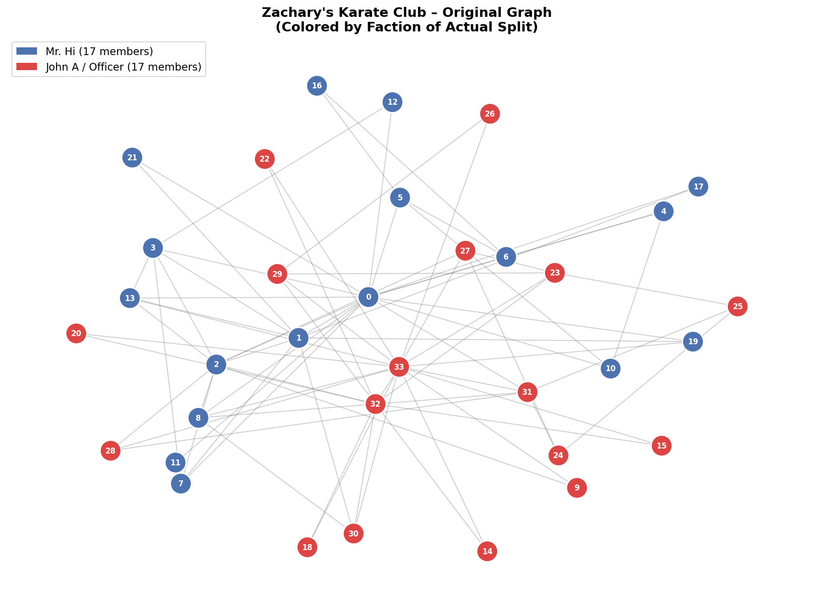
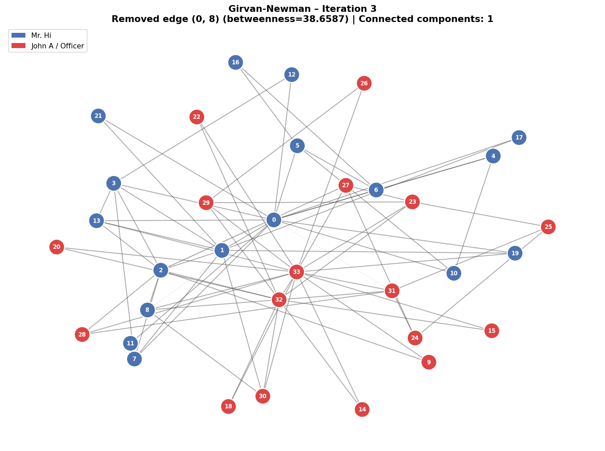
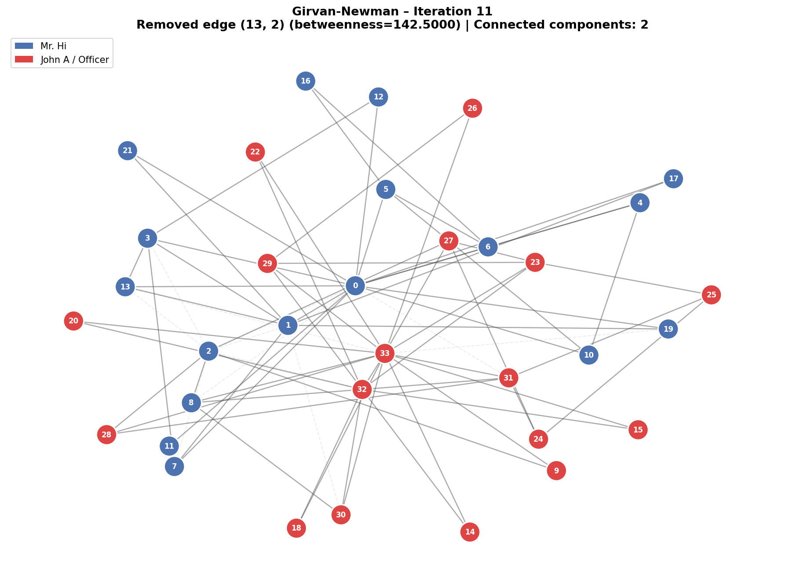
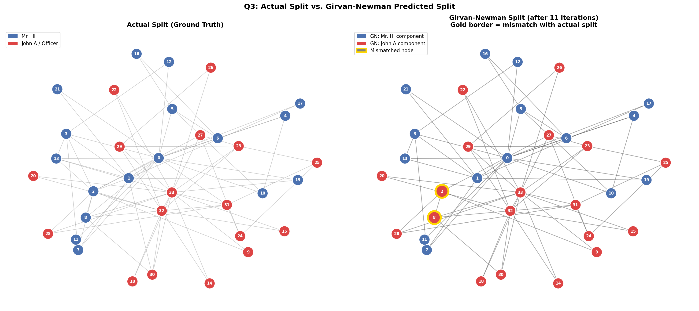

# Homework 5 - Graph Partitioning

---

## 👨‍💻 Author
**Donnel Garner**  
Old Dominion University  
Norfolk, Virginia  

**CS432 – Web Science**  
**Spring 2026**  

📅 **Due Date:** March 29, 2026  
🔗 **GitHub Repository:**
🌐 **Live Site:** N/A

---

## 📋 Table of Contents
- [How to Run](#-how-to-run)
- [Q1: Color Nodes Based on Final Split](#-q1-color-nodes-based-on-final-split)
- [Q2: Girvan-Newman Algorithm](#-q2-use-the-girvan-newman-algorithm-to-illustrate-the-split)
- [Q3: Compare Actual vs. Mathematical Split](#-q3-compare-the-actual-split-to-the-mathematical-split)
- [Technologies Used](#️-technologies-used)
- [References](#-references)

---

### Graph Partitioning — Zachary's Karate Club

This assignment demonstrates:
- Loading and visualizing real-world social network data using NetworkX
- Implementing the Girvan-Newman graph partitioning algorithm from scratch
- Computing edge betweenness centrality using BFS-based back-propagation (Brandes, 2001)
- Iteratively removing high-betweenness edges and tracking connected components
- Comparing a mathematically-predicted community split to the observed real-world outcome

This project explores a foundational question in social network analysis:  
**can the structure of social interactions alone predict how a group will fracture?**

---

## 🚀 How to Run

### Requirements
- Python 3
- `networkx` library (`pip install networkx`)
- `matplotlib` library (`pip install matplotlib`)

### Step 1: Run the analysis script
```bash
python3 karate_analysis.py
```

> This loads the Karate Club graph from NetworkX, draws the original colored graph (Q1),
> runs the custom Girvan-Newman implementation until the graph splits (Q2), saves a graph
> image after each iteration, and produces the side-by-side comparison (Q3).

### Step 2: View the outputs
All graph images are saved to the `graphs/` directory:
- `graphs/q1_original_graph.png` — original graph colored by faction
- `graphs/gn_iter_01.png` through `graphs/gn_iter_11.png` - one image per GN iteration
- `graphs/q3_comparison.png` - actual split vs. GN-predicted split side by side

---

## 📊 Q1: Color Nodes Based on Final Split

The original Karate Club graph has **34 nodes** and **78 edges**. Nodes are colored by the
faction each member actually joined after the club split:

- 🔵 **Blue** — members who sided with the instructor, **Mr. Hi** (node 0)
- 🔴 **Red** — members who sided with the administrator, **John A** (node 33)


*Figure 1. Original Karate Club graph colored by actual faction membership.*

### Answer
> **Q: How many nodes eventually go with John and how many with Mr. Hi?**
>
> The split was exactly even: **17 members sided with Mr. Hi** and **17 members sided with John A**.
> Even though the split is 50/50, the graph already hints at two clusters forming around the
> two faction leaders (nodes 0 and 33), though many cross-faction edges make the partition
> non-obvious from visual inspection alone.

| Faction | Node Count | Nodes |
|---------|-----------|-------|
| Mr. Hi (blue) | 17 | 0, 1, 2, 3, 4, 5, 6, 7, 8, 10, 11, 12, 13, 16, 17, 19, 21 |
| John A / Officer (red) | 17 | 9, 14, 15, 18, 20, 22, 23, 24, 25, 26, 27, 28, 29, 30, 31, 32, 33 |

---

## 🔬 Q2: Use the Girvan-Newman Algorithm to Illustrate the Split

### What is the Girvan-Newman Algorithm?

The Girvan-Newman algorithm finds communities in a network by slowly cutting it apart.  
The idea is simple: edges that connect two different groups will be used by a lot of people trying to get from one side of the network to the other.  
Think of it like a bridge between two neighborhoods, almost everyone crossing town has to use it.  

The algorithm measures this with edge betweenness. Basically, how many shortest paths between any two nodes pass through a given edge.  
The more paths that run through an edge, the more likely it's a bridge between two communities.  

Each iteration, the algorithm finds the edge with the highest betweenness score and removes it.  
Then it recalculates betweenness for all remaining edges (because removing one edge changes how traffic flows through the whole graph) and repeats.  
Eventually, cutting enough of these bridges causes the graph to fall apart into separate connected components: those are your communities.

**Betweenness formula:**

```
Betweenness(e) = Σ_{s≠t} [ σ(s,t | e) / σ(s,t) ]
```

where `σ(s,t)` is the total number of shortest paths from `s` to `t`, and `σ(s,t | e)` is
the number of those paths that pass through edge `e`.

### Implementation

The algorithm was implemented from scratch in Python: **no built-in community detection
functions were used**. Betweenness is recomputed from scratch after every edge removal because
removing an edge changes the shortest paths throughout the entire graph.

```python
def edge_betweenness(G):
    betweenness = dict.fromkeys(G.edges(), 0.0)
    betweenness.update({(v, u): 0.0 for u, v in G.edges()})
    for s in G.nodes():
        # BFS from source s
        S, P, sigma, d, Q = [], defaultdict(list), defaultdict(float), defaultdict(lambda: -1), [s]
        sigma[s] = 1.0; d[s] = 0
        while Q:
            v = Q.pop(0); S.append(v)
            for w in G.neighbors(v):
                if d[w] < 0: Q.append(w); d[w] = d[v] + 1
                if d[w] == d[v] + 1: sigma[w] += sigma[v]; P[w].append(v)
        # Back-propagation
        delta = defaultdict(float)
        while S:
            w = S.pop()
            for v in P[w]:
                c = (sigma[v] / sigma[w]) * (1 + delta[w])
                betweenness[(v,w) if (v,w) in betweenness else (w,v)] += c
                delta[v] += c
    for e in betweenness: betweenness[e] /= 2.0
    return betweenness

def girvan_newman_step(G):
    bet = edge_betweenness(G)
    max_edge = max(bet, key=bet.get)
    G.remove_edge(*max_edge)
    return max_edge, bet[max_edge]
```

### Iteration Results

| Iteration | Edge Removed | Betweenness Score | # Components |
|:---------:|:------------:|:-----------------:|:------------:|
| 1 | (0, 31) | 35.70 | 1 |
| 2 | (0, 2) | 33.45 | 1 |
| 3 | (0, 8) | 38.66 | 1 |
| 4 | (13, 33) | 41.00 | 1 |
| 5 | (19, 33) | 61.62 | 1 |
| 6 | (2, 32) | 50.10 | 1 |
| 7 | (1, 30) | 71.81 | 1 |
| 8 | (1, 2) | 54.63 | 1 |
| 9 | (2, 3) | 53.83 | 1 |
| 10 | (2, 7) | 71.38 | 1 |
| **11** | **(2, 13)** | **142.50** | **2 ✅** |

### Iteration Graphs

<details>
<summary>Click to expand all 11 iteration graphs</summary>

**Iteration 1** — Edge (0, 31) removed (betweenness = 35.70)  


**Iteration 2** — Edge (0, 2) removed (betweenness = 33.45)  


**Iteration 3** — Edge (0, 8) removed (betweenness = 38.66)  


**Iteration 4** — Edge (13, 33) removed (betweenness = 41.00)  


**Iteration 5** — Edge (19, 33) removed (betweenness = 61.62)  


**Iteration 6** — Edge (2, 32) removed (betweenness = 50.10)  


**Iteration 7** — Edge (1, 30) removed (betweenness = 71.81)  


**Iteration 8** — Edge (1, 2) removed (betweenness = 54.63)  


**Iteration 9** — Edge (2, 3) removed (betweenness = 53.83)  


**Iteration 10** — Edge (2, 7) removed (betweenness = 71.38)  


**Iteration 11** — Edge (2, 13) removed (betweenness = 142.50) — **SPLIT!**  


</details>

### Answer
> **Q: How many iterations did it take to split the graph?**
>
> **11 iterations.** The graph split into 2 connected components after removing edge (2, 13) in
> iteration 11. The decisive edge had a betweenness score of **142.50** — nearly double the
> next-highest score in the sequence. Node 2 had become the sole structural bridge between the
> two emerging clusters after its other connections were progressively severed, making this
> the natural breaking point.

---

## 📐 Q3: Compare the Actual Split to the Mathematical Split


*Figure 2. Left: actual split (ground truth). Right: Girvan-Newman predicted split. Gold borders indicate mismatched nodes.*

### GN Components After Split

| GN Component | Size | Nodes |
|-------------|------|-------|
| Component A (→ Mr. Hi) | 15 | 0, 1, 3, 4, 5, 6, 7, 10, 11, 12, 13, 16, 17, 19, 21 |
| Component B (→ John A) | 19 | 2, 8, 9, 14, 15, 18, 20, 22, 23, 24, 25, 26, 27, 28, 29, 30, 31, 32, 33 |

### Mismatched Nodes

| Node | Actual Faction | GN Predicted | Notes |
|------|---------------|--------------|-------|
| **2** | Mr. Hi 🔵 | John A 🔴 | High-degree bridge node; edges to Mr. Hi cluster all removed by GN |
| **8** | Mr. Hi 🔵 | John A 🔴 | Lost structural path to Mr. Hi component after bridge cuts |

**Overall accuracy: 32 / 34 = 94.1%**

### Answer
> **Q: Did all of the same colored nodes end up in the same group? If not, what is different?**
>
> **No. nodes 2 and 8 were misclassified.** Both are actual Mr. Hi members (blue) but ended
> up in the John A component after the GN split. Node 2 is a high-degree node (9 edges) that
> connects to both factions. The Girvan-Newman algorithm systematically removed all 5 of its
> edges to the Mr. Hi cluster across iterations 2, 8, 9, 10, and 11 — leaving it structurally
> attached only to the John A side. Node 8 was similarly isolated from its true faction once
> those bridge edges were cut.
>
> This reflects a known limitation of the basic (unweighted) Girvan-Newman algorithm: it treats
> all edges as equal and cannot account for the *strength* of social ties. A weighted variant
> would likely achieve a perfect 34/34 classification on this dataset.

---

## 🛠️ Technologies Used

| Tool | Purpose |
|------|---------|
| Python 3 | Core scripting and analysis |
| NetworkX | Graph loading (`karate_club_graph()`), manipulation, and component detection |
| Matplotlib | Graph visualization and image export |
| NumPy | Numerical support |
| GitHub | Version control and submission |

---

## 📚 References

- Zachary, W. W. (1977). An information flow model for conflict and fission in small groups. *Journal of Anthropological Research, 33*(4), 452–473.
- Girvan, M., & Newman, M. E. J. (2002). Community structure in social and biological networks. *Proceedings of the National Academy of Sciences, 99*(12), 7821–7826.
- Brandes, U. (2001). A faster algorithm for betweenness centrality. *Journal of Mathematical Sociology, 25*(2), 163–177.
- Hagberg, A., Swart, P., & Schult, D. (2008). Exploring network structure, dynamics, and function using NetworkX. *Proceedings of the 7th Python in Science Conference.*
- Zachary's Karate Club — Wikipedia: https://en.wikipedia.org/wiki/Zachary%27s_karate_club

---

## 🙏 Acknowledgments

Special thanks to:  
- **NASREEN MUHAMMAD ARIF** — Course instructor  
- **Old Dominion University** — Computer Science program  

---

<p align="center">
  <strong>Made with ☕ and 💻 by Donnel Garner</strong><br>
  <sub>Old Dominion University | CS 432 | Spring 2026</sub>
</p>

---

<p align="center">
  <a href="https://donnelgarner.com">🌐 Personal Website</a> •
  <a href="https://github.com/skyelogic">💻 GitHub</a>
</p>
